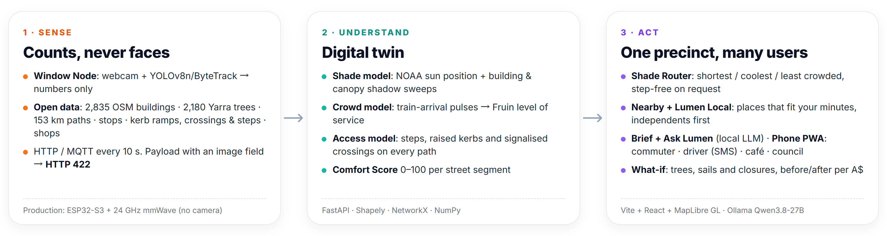
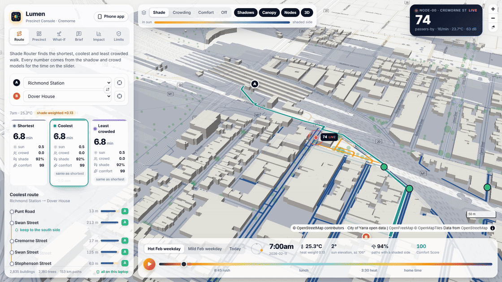
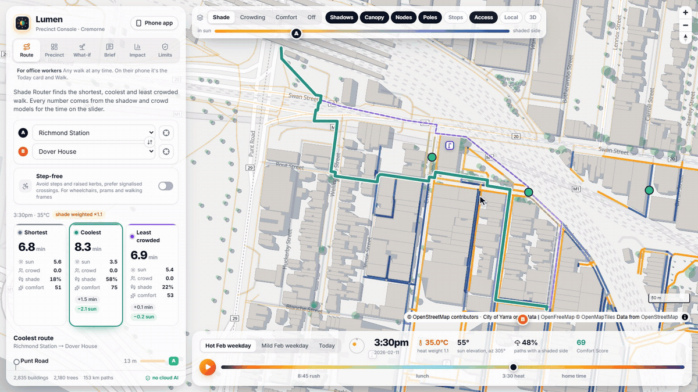
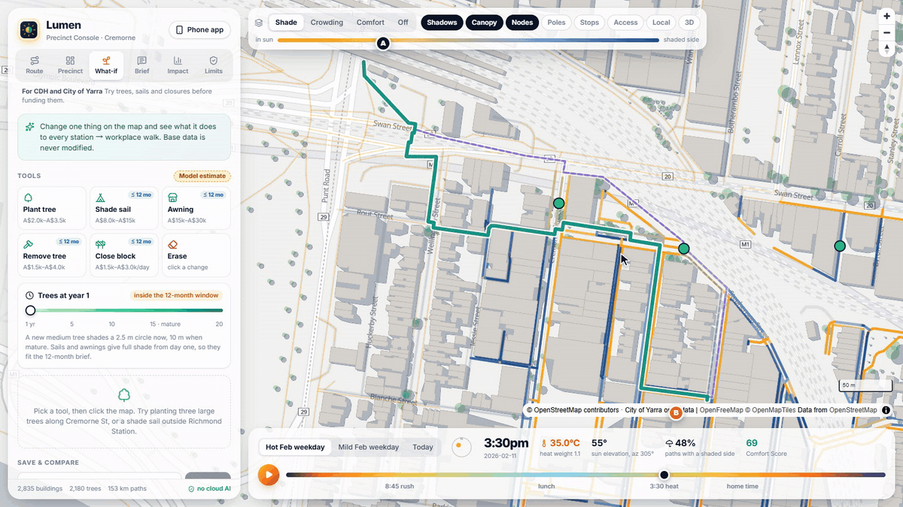
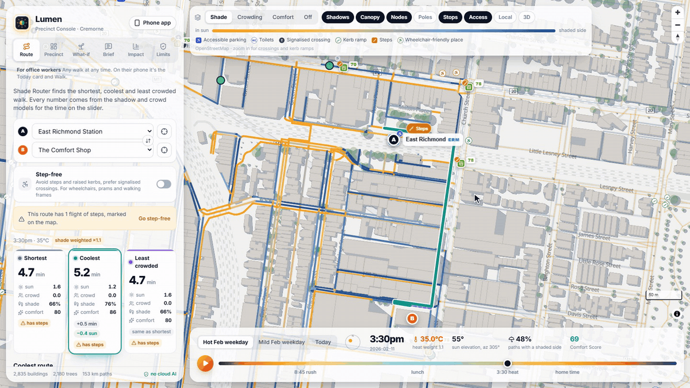
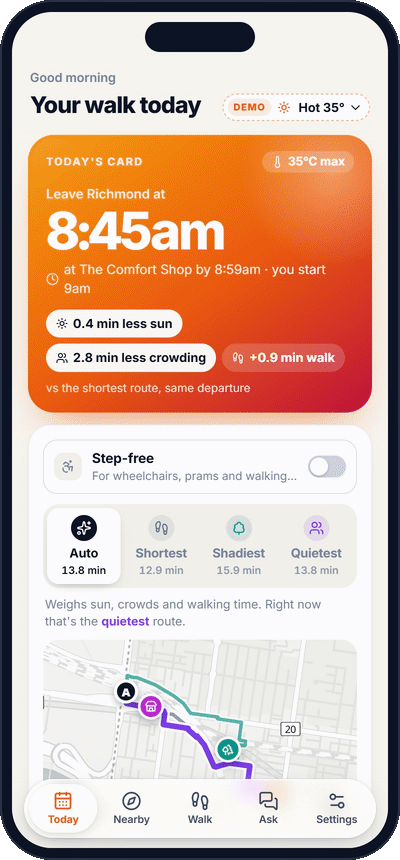
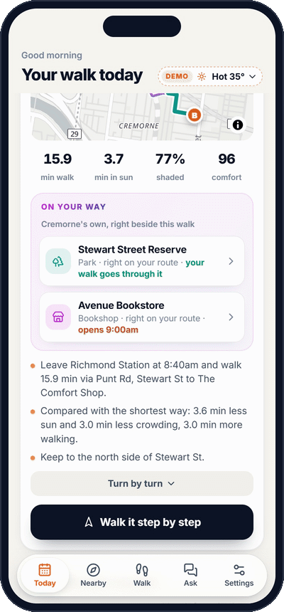

# Lumen — 700 windows, one precinct

> Lighting up a data-dark precinct, one window at a time.

**Lumen** is a walking-comfort prototype for the Cremorne precinct in Melbourne. Window-mounted counting nodes in tenants' offices sense foot traffic; shade and crowd models turn those counts into a live digital twin; and the result is served back as cooler, less crowded walking routes for commuters and as what-if scenario planning for the precinct manager and the City of Yarra.

Built at **FEIT Hackathon 2026** for the Cremorne Digital Hub challenge. The whole **Sense → Understand → Act** stack runs on a single laptop, with no cloud APIs.

<p align="center">
  
</p>

## Highlights

- **Privacy by construction.** Window nodes send counts, never images. The server rejects any payload that carries an `image` field with HTTP 422.
- **Shade that follows the sun.** NOAA solar position plus building and tree-canopy shadow sweeps across 2,835 buildings, 2,180 trees and 153 km of footpaths.
- **Crowding you can plan around.** Train-arrival pulses feed a Fruin level-of-service model for every street segment.
- **Three routes, one score.** Shortest, coolest and least crowded routes, each with a 0–100 Comfort Score.
- **Step-free when you need it.** Stations, tram and bus stops, kerb ramps, signalised crossings, steps, accessible parking and toilets are on the map from OpenStreetMap. One switch makes every route avoid steps and raised kerbs, and warns when a tram stop has no level-access platform.
- **"I've got 10 minutes."** Pick coffee, a quick bite, a shady spot to sit, toilets or cash and a time budget; Lumen lists only the places you can reach, use and get back from in time, routed the comfortable way.
- **Lumen Local: a reason to come in.** Cremorne's independent shops, gyms and classes sit next to coffee and shade in Nearby, chains left out. The Today card points out one or two of them, or a park, right beside the walk you're already doing ("Abbotsford Cycles · 1.6 min off route"), and the Console has a Local layer.
- **Evidence for council.** Plant trees, add shade sails or close a footpath on the map, then see the before/after for all 304 station-to-office walks, with a cost estimate, in under half a second.
- **One precinct, many users.** A Console for the precinct hub and council, and a phone PWA for commuters, delivery drivers, café owners and the hub, with an SMS channel for drivers who won't install an app.
- **Offline, local LLM.** An optional Ollama model rewords the Morning Brief and powers Ask Lumen. If the model changes any number, Lumen falls back to a deterministic template.

## See it in action

**Console** (precinct hub and council)

| Shade flows with the sun | Crowding after train arrivals |
| --- | --- |
|  |  |
| **What-if planning for council** | **Step-free routes and the Access layer** |
|  |  |

**Phone app** (commuters, drivers, merchants)

| Today card | Pop out nearby | Ask Lumen |
| --- | --- | --- |
|  |  |  |

## How it works

| Layer | What's in the prototype | Code |
| --- | --- | --- |
| **Sense** | Window Node counter (YOLOv8n + ByteTrack, OpenCV motion detection, simulation, or manual keyboard counting) that reports numbers only. Open data: 2,835 OSM buildings, 2,180 trees (City of Yarra street trees + OSM), 153 km pedestrian network, train and tram stops, and the locations of City of Yarra's six ENE.HUB smart poles (their data isn't published) | `node/window_node.py`, `data/fetch_osm.py`, `data/raw/yarra_smart_poles.json` |
| **Understand** | Shade model: NOAA sun position, swept building shadows and tree-canopy shadows, taking the shadier side of each segment. Crowd model: train-arrival pulses and Fruin LOS | `backend/lumen/shade.py`, `crowd.py` |
| **Act** | Shade Router with three route options and a Comfort Score. Morning Brief (Slack-style) and Ask Lumen Q&A. Step-free routing. Precinct Console (hub and tenant views, weekly CSV report, **what-if scenarios**). **Phone PWA** for commuters, drivers, merchants and CDH: Today card, Nearby with Lumen Local, Walk, Ask, and simulated SMS. Offline evaluation | `router.py`, `access.py`, `whatif.py`, `personal.py`, `nearby.py`, `sms.py`, `brief.py`, `evaluate.py`, `frontend/` |

One server, two front doors:

- **Console** at http://localhost:8000: for Cremorne Digital Hub (CDH) and council. Full map, what-if planning and weekly reports.
- **Phone app** at http://localhost:8000/m: for everyone else. It shows only the one or two things that matter to you today. There's no login and settings stay on the phone. The **Phone app** button in the Console's top-right corner shows a QR code for the LAN address (or for `LUMEN_PUBLIC_URL` when deployed).

## Results

Offline evaluation (`python -m lumen.evaluate`, run from `backend/`) covers 304 trips from 4 stations to 76 office buildings:

| Scenario | Sun exposure cut by coolest route (median) | Median detour | Trips improved |
| --- | --- | --- | --- |
| Hot day 35°C · 15:30 | **−41%** (1.8 min less sun) | 0.5 min | 80% |
| Hot day · 8:45 (26.9°C) | **−46%** (2.1 min less sun) | 0.2 min | 87% |
| Mild control day 21°C · 15:30 | 0% (no detour, by design) | 0 | 0% |

On crowding, 94 trips pass through LOS D or worse at 8:45 on the hot day. The least-crowded route cuts median crowded walking time on those trips by **93%**, for a median detour of 0.8 minutes.

## Quick start

Requirements: Python 3.10+ and Node.js 20.19+ (the minimum for Vite 8). Commands below are for PowerShell; on macOS or Linux, replace `;` with `&&`.

```powershell
# 1. Backend dependencies (once)
pip install -r backend/requirements.txt

# 2. Build the frontend (once; re-run only after changing frontend code)
cd frontend; npm install; npm run build; cd ..

# 3. Start the server (serves both the API and the web app)
python backend/server.py
```

Open http://localhost:8000. On Windows you can also just run `start.ps1`.

> On first launch, the server precomputes the evaluation and a full day of shadow frames and caches them in `data/cache/`. This takes about 2 minutes the first time and is instant after that. **Run it once before a demo.**

### Window Node

```powershell
pip install -r node/requirements.txt
python node/window_node.py --mode motion --show      # webcam + motion detection (lightweight)
pip install ultralytics                              # optional, ~1 GB including PyTorch
python node/window_node.py --mode yolo --show        # webcam + YOLOv8n + ByteTrack
python node/window_node.py --mode simulate --rate 30 # rehearse without a camera
python node/window_node.py --mode keyboard           # manual counting, also useful for accuracy tests
```

The server accepts readings at `POST /api/live/ingest` and streams them at `GET /api/live/stream`; the Console doesn't show a live node (all 13 nodes on the map are replayed). To use MQTT, start the node with `--mqtt localhost`, set `LUMEN_MQTT=localhost` on the server, and install `paho-mqtt`.

In production the node would be an ESP32-S3 with a 24 GHz mmWave sensor, so there would be no camera at all.

### Local LLM (optional)

Install [Ollama](https://ollama.com) and run `ollama pull qwen3.8:27b` (about 18 GB; needs a GPU with 24 GB of VRAM). The server detects it automatically and uses it to polish the Morning Brief and to do tool calling for Ask Lumen.

- The LLM only rewrites wording. If any number in its output differs from what the backend computed, Lumen falls back to the deterministic template.
- Without Ollama, the Brief uses the template and Ask Lumen uses rule-based routing. Every feature still works.
- Thinking is switched off on every request (`think: false`): both tasks are short and need a fast reply.
- To switch models, set `LUMEN_MODEL`, for example `LUMEN_MODEL=qwen3.5:9b` on a machine without a GPU.

### Frontend dev mode

```powershell
python backend/server.py          # terminal 1
cd frontend; npm run dev          # terminal 2 → http://localhost:5173 (proxies /api to 8000)
```

Set `LUMEN_API` (e.g. `http://localhost:8010`) to point the dev proxy at a backend on another port.

### Docker

The image holds the backend and the prebuilt frontend in one process, so build the frontend first:

```powershell
cd frontend; npm install; npm run build; cd ..
docker build -t lumen .
docker run -p 8000:8000 -e LUMEN_PUBLIC_URL=https://your.domain -v ${PWD}/data/cache:/app/data/cache lumen
```

`data/cache` (shadow frames, evaluation) and `data/whatif` (saved scenarios) are the only paths the server writes, so the container can otherwise run read-only. The hosted demo runs this image behind Caddy. SMS sessions and the what-if registry live in process memory, so run one worker per replica and use sticky sessions if you run more than one.

### Environment variables

| Variable | Default | Effect |
| --- | --- | --- |
| `LUMEN_HOST` / `LUMEN_PORT` | `0.0.0.0` / `8000` | Where the server listens |
| `LUMEN_PUBLIC_URL` | (LAN address) | The address the Console's phone QR code points to |
| `LUMEN_MODEL` | `qwen3.8:27b` | Ollama model for the Brief and Ask Lumen |
| `LUMEN_OLLAMA` | `http://127.0.0.1:11434` | Ollama server |
| `LUMEN_MQTT` / `LUMEN_MQTT_PORT` | off / `1883` | Subscribe to window nodes over MQTT |
| `LUMEN_API` | `http://localhost:8000` | Backend for the Vite dev proxy (frontend only) |

## Console (/)

Six tabs, each labelled with who it's for:

| Tab | For | What's there |
| --- | --- | --- |
| **Route** | office workers | Any start and destination at any time: shortest, coolest and least crowded walks with sun, crowd, shade and Comfort Score, turn-by-turn with "keep to the shady side" tips. A **Step-free** switch avoids steps and raised kerbs and prefers signalised crossings; without it, a route that has steps says so and offers "Go step-free" |
| **Precinct** | CDH | Hub view (precinct health, the most crowded and most sun-exposed segments, weekly CSV) and Tenant view (hourly foot traffic outside a window node, for a café or shop) |
| **What-if** | CDH and City of Yarra | Trees, sails, awnings and closures, with before/after and cost (below) |
| **Brief** | tenant staff | The Morning Brief as it would be posted to workplace Slack, and Ask Lumen; answers about streets outline them on the map, and route answers have "Show on map" |
| **Impact** | decision makers | The offline evaluation over 304 station-to-office walks (see Results) |
| **Limits** | everyone | Who Lumen doesn't serve yet, privacy, data sovereignty and running cost |

Map layers (top bar): the footpath network coloured by **Shade**, **Crowding** or **Comfort** (or **Off**), plus toggles for **Shadows**, **Canopy**, **Nodes** (the 13 replayed window nodes), **Poles** (Yarra's 6 smart poles), **Stops** (train, tram and bus), **Access** (accessible parking, toilets, signalised crossings, kerb ramps, steps and wheelchair-friendly places from OSM; crossings and ramps appear when zoomed in), **Local** (Lumen Local's independent shops and gyms; hover a pin) and **3D** buildings. The time bar picks the day (hot weekday, mild weekday or today) and the time, with jumps to the 8:45 rush, lunch, 3:30 heat and home time, and ▶ plays the day in 15-minute steps.

## What-if planning (Console → What-if)

Change one thing on the map and immediately see the effect on all 304 station-to-office walks in the precinct. The base data is never modified; each scenario is a layer on top.

| Tool | What it does | Deliverable within 12 months? | Indicative cost (A$, installed) |
| --- | --- | --- | --- |
| Plant a tree (S / M / L) | Circular canopy, shaded with the same model as existing street trees | No. Full canopy takes about 15 years; use the maturity slider to compare year 1 and year 15 | 1.2k–2k / 2k–3.5k / 3.5k–6k |
| Shade sail 6 × 6 m | Rectangle 4 m above ground, aligned to the nearest street | Yes | 8k–15k |
| Awning 12 m | 3.2 m above ground, against the shopfront | Yes | 15k–30k |
| Remove a tree | Click an existing canopy | Yes | 1.5k–4k |
| Close a footpath for works | Click a footpath to close it between the two nearest intersections | Yes | 1.5k–3k per day (traffic management) |

- **Incremental recompute.** Lumen re-tests only the sample points inside added or removed shade, and re-routes only the origin–destination pairs whose best path crosses a changed segment (typically 20–60 of 304). A recompute takes about 0.1–0.5 s.
- **Before/after comparison.** Sun-exposed minutes on common routes (before → after), number of routes that benefit, Comfort Score, share of path on the shaded side, the detour needed to avoid sun (Lumen's coolest route), and detours caused by closures. On the map, green segments gained shade, red segments lost it, dashed red lines are closed, and dark green is new shade.
- **Cost.** A total cost range, line items, cost per improved route, and the portion deliverable within 12 months. These are indicative planning ranges, not quotes; opening a new tree pit in an existing footpath (with structural soil) can cost several times more.
- **Saved scenarios.** Name and save scenarios to `data/whatif/`, compare several side by side, and export a CSV (before/after for three weather scenarios, each intervention with its cost, and affected trips) as material for council.
- Every result in the UI is labelled **Model estimate**.

**Comfort Score** (0–100 per segment, length-weighted up to a route or the whole precinct):

```
Comfort = 100 − 60 × sun_fraction × min(H, 1) − 40 × min(LOS_penalty, 2) / 2
H       = max(0, (T − 24) / 10)
```

Full sun at 34°C or above costs 60 points; LOS E or worse costs 40.

Any saved scenario can be re-run offline (only the affected OD pairs are recomputed):

```powershell
cd backend
python -m lumen.evaluate --plan <saved scenario id or JSON file>
```

## Phone app (/m)

Onboarding asks only for your role and a few places, and stores them on the phone (localStorage). There's no account and no location access. Each request carries only place IDs, which are discarded after use.

The tab bar (a frosted "liquid glass" bar) depends on the role: commuters get **Today · Nearby · Walk · Ask · Settings**, drivers get **Today · Texts · Settings**, everyone else **Today · Settings**. The **Demo** switch in the header picks the day (Hot 35°, Mild 21° or Today), and **Step-free** is one switch on the Today card, in Nearby and in Walk, remembered on the phone.

| Role | Home screen | Recommendations (rules computed by the backend) |
| --- | --- | --- |
| Commuter | **Today card**: when to leave the station and which way to walk ("X min less sun, Y min less crowding, Z min extra walking than the shortest route"), with a mini map. Pick **Auto / Shortest / Shadiest / Quietest** (the others stay faded on the map to tap), see independent places **on your way**, and follow it step by step. **Nearby** tab: what fits in the minutes you have (below). **Walk** tab: any start, destination and time, with the same four ways to walk and step-by-step directions. **Ask** tab: Ask Lumen, where route and place answers open in Walk | Which nearby street is quiet for lunch and when to avoid the rush; the coolest way to a meeting in another building on a hot day |
| Delivery driver | All-day crowding bands for your usual streets, and busy periods | Unloading windows that avoid train-arrival peaks; the best common window across your whole run; the same content as SMS |
| Merchant | Hourly foot traffic outside your door, compared with the same day last week | When to add staff, whether to open earlier or close later, and quiet periods |
| CDH / council | Precinct Comfort Score, the most crowded and most sun-exposed streets | Open the full Console (including what-if) and download the weekly CSV |

### Pop out nearby (commuter → Nearby)

"I've got **15 min** for **coffee**." Pick what you need, how long you have and the trip (back to your desk, on your way in from the station, or heading home). Lumen shows only the places that fit, the best one first, with a time bar (walk · order · back · spare), a mini map and the time you'll be back.

```
walk out + time there + walk back (or on to work)  <=  your budget
```

- **Places.** 11 categories from OpenStreetMap POIs (`data/raw/pois.json`): coffee, quick bite, sit-down lunch, shady rest (parks, benches, picnic tables, shelters), groceries, pharmacy, cash, toilets, water, and two from Lumen Local (below).
- **Lumen Local.** *Local shops* is every independent shop you can walk in and browse (bookshops, bike shops, bakeries, a chocolatier, a butcher, an op shop…); *Gyms & classes* is fitness centres, climbing walls, dojos and dance studios. Both leave out chains (anything with an OSM `brand` tag, plus a short list of chains OSM hasn't tagged yet, such as King Living), vacant shops, car yards and other shops you can't browse, sports pitches, and stadium-sized venues like Melbourne Park. Gyms & classes starts at 90 min heading home, since a class is ~45 min on its own. Results show an "Independent" tag, the shop's own description and website when OSM has them.
- **On your way.** The Today card lists up to two independent places, or a named park, within ~120 m (on foot, step-free if you've switched that on) of the route it's showing, one per kind, sorted by the detour. Tap one and Nearby opens on that place, on the trip it fits: on your way in if it's open as you pass, otherwise a lunchtime wander, or heading home for a class. If it doesn't fit, Nearby says why and offers the fix ("Make it 20 min", "Try 9am").
- **Time there.** Errands use an estimate that grows in the morning and lunch rush (a coffee is ~3 min, ~4.5 min at 8:45). A rest stop gets whatever the budget leaves, rounded down to whole minutes.
- **Opening hours.** Read from OSM `opening_hours` where mapped (a small parser covers the forms used in Cremorne). Where they aren't, a typical window for that kind of place is assumed and the result says "Hours not listed". Closed places are dropped, and if everything is closed or nothing fits, the screen says so and offers a fix ("Make it 11 min", "Try 10am").
- **What a normal map can't tell you.** Every leg is routed shortest / coolest / calmest and the most comfortable one that still fits is kept. Rest spots are ranked by how long you can sit and how shady the spot is *while you sit there* (the shadow model is sampled over your stay; parks by shaded area), plus crowding at the door.
- **Pick the way.** Like the Today card, the best place has Auto / Shortest / Shadiest / Quietest; any way that doesn't fit the budget is greyed out, and the other ways sit faded on the map to tap. The choice is shared with the Today card.
- **Walk it in the app.** "Start walk" steps through the route Lumen picked (turn onto which street, how far, how shady, which side of the street to keep to), with the map following each step, then the stop and the walk back. It stays on the shady / calm route instead of handing off to a maps app that would re-route the shortest way. There's no GPS: you tap Next as you go.
- **Also in Ask Lumen.** "Coffee on my way from East Richmond at 8:30am, 15 min?", "Shady spot to sit for 30 min at 12:30pm?", "Any gyms near me after work?" or "A bookshop in 40 min?" go through the same engine (`find_nearby` tool, with a rule-based fallback). "Show on map" draws the walk in the Console; on the phone, "Open in Walk" lets you follow it.

### How the phone app works

- **Recommendation logic.** Your settings, today's temperature and the crowd model go in; backend rules compute every recommendation and number. A local LLM, if present, only polishes the wording, with the same number check as the Brief.
- **SMS for drivers only.** The phone simulates the full conversation: JOIN, pick streets, then one message a day at 6:30, with TODAY / CHANGE / STOP / HELP. Free-text questions such as "busy on Church St at 5pm?" get a rule-based answer from the same street windows (no LLM, so the numbers match TODAY). You only get messages after sending JOIN. Lumen stores only the chosen streets, never the phone number or location, and STOP deletes them. Messages use only GSM-7 characters (up to 160 per message).
- **Data sovereignty.** Common SMS providers such as Twilio are hosted overseas. The demo doesn't send real texts; in production this would use an Australian-hosted SMS gateway, and messages would contain only public, street-level information.
- **Delivery.** It's a PWA (manifest + service worker, installable to the home screen). The original plan called for Next.js; the prototype keeps the existing Vite + React app and adds a `/m` route, so a single FastAPI process still serves everything offline without a separate Node server.

## Demo script: a day in the life of Mia (about 4 minutes)

Mia is a fictional commuter.

| When | Action | What to point out |
| --- | --- | --- |
| Opening | Map with **Nodes** and **Poles** on: 13 window nodes (circles) next to council's 6 smart poles (squares) | Council has 6 poles; 700 tenants means 700 sensors. Nodes send only numbers, and the server rejects anything else (a request with an `image` field gets a 422) |
| 8:15 | **Brief** tab: the Morning Brief in Slack | Every number comes from the backend; the LLM runs locally |
| 8:45 | Click "8:45 rush" on the timeline and switch the layer to "Crowding" | Swan St and Cremorne St reach LOS D after trains arrive at Richmond. The least-crowded route adds 0.8 min but cuts crowded walking from 3.0 to 0.2 min (Richmond → Dover House) |
| 12:30 | Ask Lumen: "Where's quiet for lunch?" | Tool calling queries the crowd model |
| 15:30 | Click "3:30 heat", turn on 3D and press ▶ | Shadows flow with the sun and routes change with them. Richmond → Era Building: 1.2 min longer, 6.8 min less sun |
| 15:30 | **Route**: East Richmond Station → The Comfort Shop, then switch on **Step-free** (Access layer on) | The route had a flight of steps; step-free avoids it for 0.7 min more walking. Kerb ramps, signalised crossings and steps are on the map |
| All day | **Precinct → Tenant view** | A café owner sees hourly foot traffic outside their door and uses it to plan shifts |
| Weekly | **Precinct → Hub view → Download CSV** | Which segments are persistently crowded or sun-exposed: evidence for asking council for shade |
| Council | **What-if**: at 3:30 heat, plant 5 large trees along Cremorne St and drag maturity to year 15 → back to year 1 → swap for shade sails | "Asking council for shade" becomes quantified evidence: sun-exposed minutes before and after, routes that benefit, cost. Year 1 does almost nothing, which is exactly why shade sails are the 12-month answer |
| Council | Save two scenarios → compare side by side → Council CSV | Material ready to hand to council, all labelled as model estimates |
| Phone | Scan the Console's QR code → choose "Commuter" | Today card: when to leave, which way to walk, how many fewer minutes in the sun |
| Phone | Tap **Shadiest**, then **Avenue Bookstore** under "On your way" | Lumen Local: Cremorne's own shops beside the walk, chains left out. The bookshop opens at 9, so Nearby offers it as a lunchtime wander and walks Mia there step by step |
| Phone | **Got a few minutes? → Shady break**, then tap − to 5 min | 12:30 on a 33°C day: only spots you can sit at and still be back in time, ranked by shade while you sit. At 5 min nothing fits, and the screen offers the smallest budget that works |
| Phone | Switch to "Driver" → Texts → JOIN → `1 6` | People without the app are covered too. SMS is simulated in the demo; production would use a local gateway |
| Close | **Impact** tab, then **Limits** tab | A reproducible offline evaluation, and an upfront account of who it doesn't serve yet (delivery drivers, merchants and frontline workers are now covered; the page marks each group covered / partly / not yet) |

## What's real, what's modelled, what's synthetic

| Real / measured | Modelled / estimated | Synthetic (labelled in the UI) |
| --- | --- | --- |
| OSM building footprints, path network, stations, shops and fitness places (Lumen Local) | Missing building heights: levels × 3.5 m, otherwise a default by building type | Readings for all 13 "replayed" window nodes are generated by the crowd model (no node is deployed yet) |
| City of Yarra street trees (with trunk diameter) | Canopy radius estimated from trunk diameter; growth curve for new trees (full canopy at 15 years) | Split of 10,000 workers across stations |
| Sun position (NOAA algorithm) | Footpath widths by street class, hand-corrected on main roads | Static approximation of train headways (GTFS-R integration pending) |
| Locations of Yarra's 6 smart poles (council project page, geocoded by address) | LOS: peak-minute flow ÷ effective width | Hot-day temperature curve |
| Places in `data/raw/local_extra.json`: hand-added from public listings, for real places OSM is missing (empty until the team verifies some; nothing is invented) | Opening hours where OSM has none (typical for the kind of place, labelled "Hours not listed"); class length ~45 min | |
| | All what-if results; cost ranges (planning references, not quotes) | Merchants' "same day last week" comparison (replayed data) |
| | Comfort Score weights | SMS conversations (simulated on the phone, never sent) |

## Tech stack

- **Backend:** Python, FastAPI, Shapely, NetworkX, NumPy; SSE for live updates; optional MQTT
- **Frontend:** Vite, React, TypeScript, MapLibre GL JS; PWA for mobile
- **Sensing:** OpenCV, YOLOv8n + ByteTrack (Ultralytics)
- **LLM (optional):** Ollama with Qwen3.8-27B, fully local

## Project layout

```
data/fetch_osm.py        Downloads OSM data (cached in data/raw/)
backend/server.py        FastAPI: API + static frontend + SSE live stream
backend/lumen/           geo / sun / precinct / shade / crowd / router / engine / evaluate / brief / live
                         whatif (scenario overlay, before/after, cost, saving)
                         personal (phone home screens and recommendations per role) · sms (simulated SMS channel)
                         nearby (places that fit a time budget: POIs, opening hours, rest-spot shade, Lumen Local)
                         access (step-free barriers, crossings and the Access layer, from data/raw/access.json)
data/raw/local_extra.json  Hand-added Lumen Local places OSM is missing (verified real ones only), e.g.
                         {"name", "kind": "shop"|"fitness", "tag": "florist"|"boxing", "lat", "lon",
                          "address", "opening_hours", "blurb", "website", "source": "Google Maps, checked <date>"}
data/whatif/             Saved scenarios (not committed)
node/window_node.py      Window Node demo
frontend/                Vite + React + MapLibre GL; / is the Console, /m is the phone PWA (src/mobile/)
Dockerfile               Server image: backend + prebuilt frontend/dist
pitch-media/             README and pitch media; rec/ holds the Playwright scripts that record the GIFs
```

<details>
<summary><strong>API reference</strong></summary>

**Core:** `GET /api/state?scenario=hot&t=525` · `GET /api/shadows?...` · `GET /api/route?from=train-richmond&to=<office id>&t=930` (`&step_free=true` avoids steps and raised kerbs) · `GET /api/meta` · `GET /api/layers/{network|buildings|trees|transit|access|local}` (GeoJSON) · `GET /api/nodes/{id}/profile` · `GET /api/evaluation` · `GET /api/brief?office=` · `POST /api/ask` · `POST /api/live/ingest` · `GET /api/live/stream` · `GET /api/live/state` · `POST /api/live/reset` · `GET /api/report` · `GET /api/report.csv`

**What-if:** `POST /api/whatif/compare` (`{items, years, scenario, t}` → scenario key + before/after; afterwards `/api/state` and `/api/route` accept `&plan=<key>`) · `GET/POST /api/whatif/plans` · `DELETE /api/whatif/plans/{id}` · `GET /api/whatif/side-by-side?ids=` · `GET /api/whatif/export.csv?ids=` (`POST` exports an unsaved draft)

**Phone app:** `GET /api/me/commuter?stop=&office=&arrive=09:00` · `GET /api/me/driver?streets=Swan Street,Cremorne Street` · `GET /api/me/merchant?node=node-03&open=07:00&close=16:00` · `GET /api/me/council` · `POST /api/sms` (`{session, text}`, simulated SMS gateway) · `GET /api/nearby?want=coffee&budget=15&from=<office id>&t=750` (add `&shape=via&to=<id>` for a stop on the way; `want` is one of the keys in `/api/meta` → `nearby`, including `local` and `fitness`; `&focus=<place id>` keeps that place in the results or says why it doesn't fit) · `GET /api/layers/local` (Lumen Local places as GeoJSON). `/api/me/commuter` cards carry `on_the_way`; it and `/api/nearby` take `&step_free=true`.

</details>

## Data sources and licences

- Buildings, path network, stations and some trees: © [OpenStreetMap](https://www.openstreetmap.org/copyright) contributors, licensed under the [ODbL](https://opendatacommons.org/licenses/odbl/). The files cached in `data/raw/` are Overpass API exports and can be re-downloaded with `python data/fetch_osm.py`.
- Street trees: City of Yarra open data (street tree inventory). Please follow its open data licence and credit the source when reusing it.
- Map rendering: [MapLibre GL JS](https://maplibre.org/).
